# Practical Project

## Contents
* [Introduction](#introduction) 
  * [Objective](#objective)
  * [Proposal](#proposal)
* [Architecture](#architecture)
  * [Risk Assessment](#risk-assessment)
  * [Kanban Board](#kanban-board)
  * [Test Analysis](#analysis-of-testing)
* [Infrastructure](#infrastructure)
  * [Jenkins](#jenkins)
  * [Entity Diagram](#entity-diagram)
  * [Docker Swarm](#interactions-diagram)
  * [The 4 Services](#the-4-services)
* [Development](#development)
  * [Front-End Design](#front-end)
  * [Unit Testing](#unit-testing)
* [Footer](#footer)

## Introduction

### Objective
The objective provided for this project is as follows:
> To create a service-orientated architecture for your application, this application must be composed of at least 4 services that work together.

More specifically, these 4 services should comprise of 1 front-end wrapper service, 2 (or more) back-end services, and 1 other back-end service that relies on data from the previous 2 back-end services in some way.

The following constraints were also set:
* Kanban Board: Asana or an equivalent Kanban Board
* Version Control: Git - using the feature-branch model
* CI Server: Jenkins
* Configuration Management: Ansible
* Cloud server: GCP virtual machines
* Containerisation: Docker
* Orchestration Tool: Docker Swarm
* Reverse Proxy: NGINX
* Database Layer: MySQL

### Proposal
To meet all of the requirements and to ensure the MVP was produced in the time-frame provided, I first had to realise that the importance of this project was the infrastructure and implementation of my CI/CD. This means the application itself is less important, and so the proposal is fairly trivial.

#### Weapons Generator
* Service 1 (front-end): displays the results of the following 3 services for the user to see, as well as a brief history of past results
* Service 2: returns a random rarity for the weapon
* Service 3: returns a random set of stats for the weapon, such as power and speed stats
* Service 4: returns a rating (%) for the weapon based on its rarity and stats

## Architecture
### Risk Assessment
My detailed risk assessment can be seen below, outlining the minor and major risks that have potential to impact the success of this project. Creating a risk assessment is important in any project as it helps make the project more robust and provides methods of mitigating the impact of any such risk that does occur.

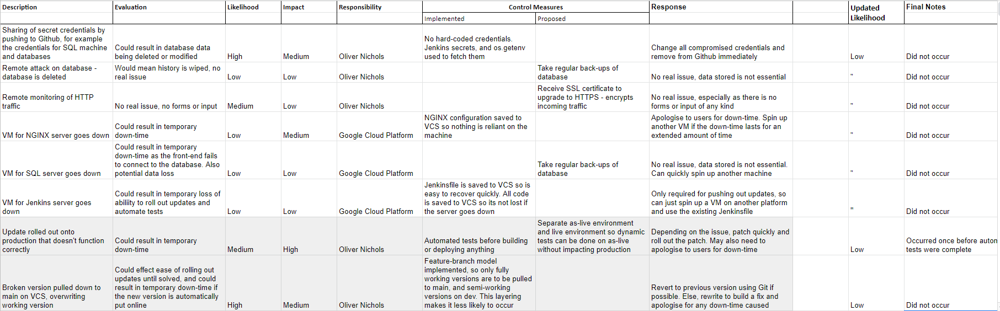

*Highlighted rows indicate risks that were not in the initial design, but instead were added as the project developed.*  
View the original document [here](https://docs.google.com/spreadsheets/d/1QkGJkaVjydPJC4k7UaFXnvH9BEQ1lJtRDGy2mzGc0WE/view?usp=sharing)

### Kanban Board
My project tracking board can be seen below. [Trello](https://trello.com) was used over other similar providers as Trello is lightweight, free-to-use, and presents the board in a very visual way.

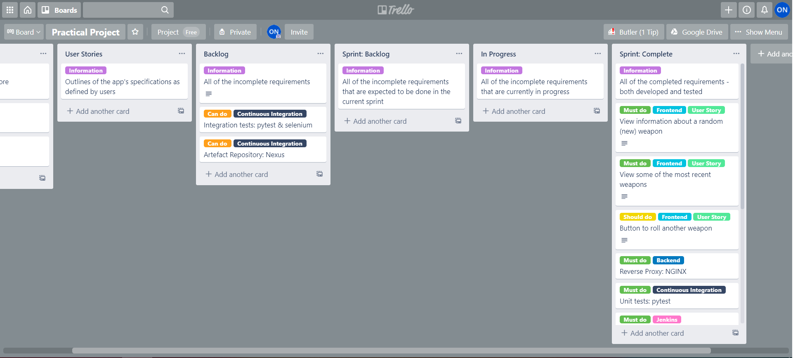

View the original board [here](https://trello.com/b/PtI5WULK/practical-project)

### Analysis of Testing
Testing is an essential part of any successful project. Since this project is using a CI/CD approach, it is vital to plan the areas of the application that need to be tested, and to implement a system to run automated tests.  

To start this process, I first had to realise the scope of the testing for this project.

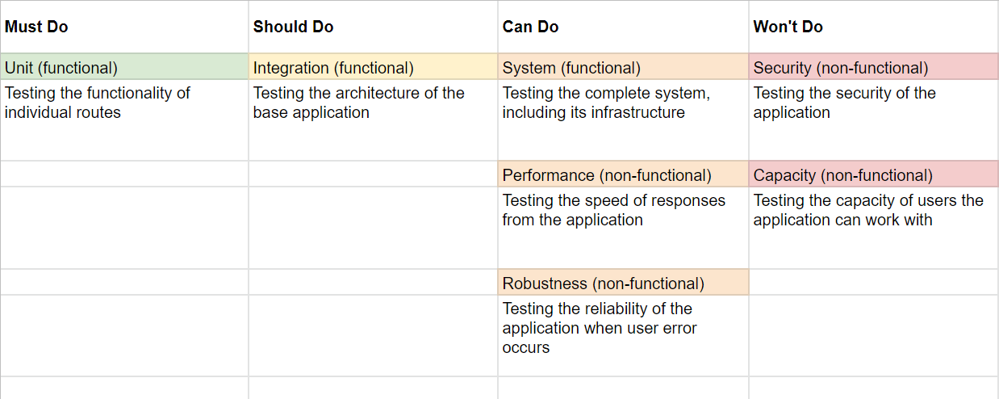
Based on this result, it is clear that unit testing is the only essential form of testing required to produce the MVP, followed by integration testing which has been marked as a 'Should do' on the [MoSCoW](https://en.wikipedia.org/wiki/MoSCoW_method) scale.  
View the original document [here](https://docs.google.com/spreadsheets/d/1Lliihfz7-UebmVIUNQpaN3hqFmwkPL7Lv7RjLHl-WFY/view?usp=sharing)

I then went on to plan the testing that needed to be done, as well as some pseudo-code for my own personal reference. The right-most columns shown below are used to track what tests still need to be implemented.  

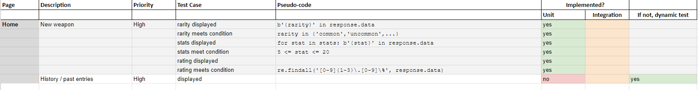
View the original document [here](https://docs.google.com/spreadsheets/d/1WQip55_7jBpuaqHeQmPLJc7Zmg7jZhXBJG8hwkSX8S8/view?usp=sharing)

## Infrastructure
Continuous deployment is implemented throughout my project in order to allow rapid and smooth development-to-deployment. The approach I have taken allows deploying new versions of the application with limited down-time.

### Jenkins
Whenever new content is pushed to the `dev` branch, Github will send a webhook to Jenkins which tells it to run the following pipeline:

#### **1.** Test: pytest  
> Unit tests are run as outlined [earlier](#analysis-of-testing). A coverage report is produced and can be viewed in the console logs. 

#### **2.** & **3.** Build & Push: docker-compose  
> Jenkins' credentials system is used to handle logging into DockerHub, and the new images are then pushed to the repository specified.

#### **4.** Configure: ansible 
> Ansible configures several things:
> * Installing dependencies (such as docker and docker-compose),
> * Setting up the swarm, and joining the swarm on all worker nodes,
> * Reloading NGINX with any changes to the nginx.conf file.

#### **5.** Deploy: docker swarm/stack 
> Jenkins copies the `docker-compose.yaml` file over to the manager node, SSH's onto it, and then runs `docker stack deploy`.

*The commands used in Jenkins' pipeline can be seen in the [Jenkinsfile](./Jenkinsfile)*

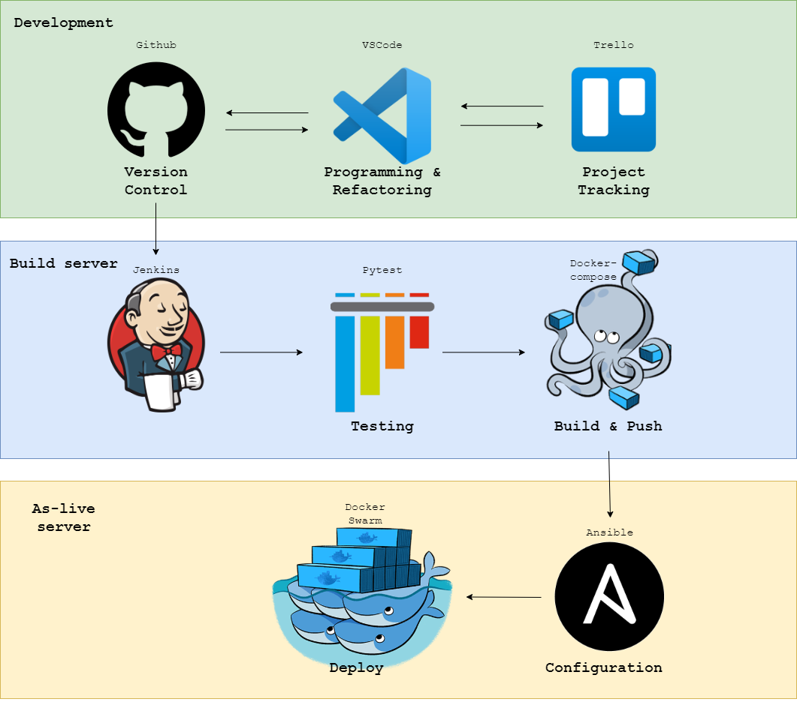

### Entity Diagram
While this project only makes use of one table in its database, it is still important to describe the structure of this table. Describing the elements in the table means that the validation required for each element is outlined explicitly, and can be tested accordingly.

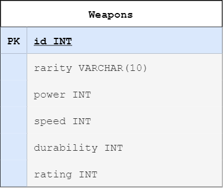
 
### Interactions Diagram
In the following diagram we are able to see the layout of the virtual machines as used in this project. This maps out where the information is taken from as a user connects to the NGINX machine on port 80.

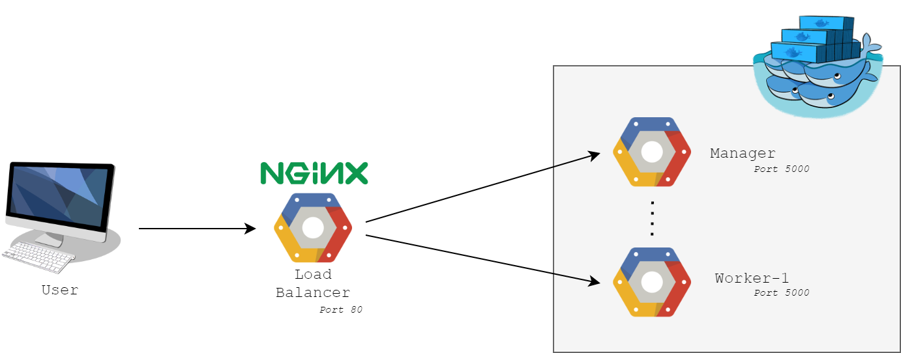

Using an orchestration tool, Docker Swarm, we are able to create a network of virtual machines that are all able to be accessed by the user to provide the same service. As mentioned previously, I have also implemented another layer to the system in the form of an NGINX load-balancer (LB), which up-streams the user to the VM with the least connections. The extra layer provided by this NGINX LB also further abstracts the application from the user which further increases the security of the app as a whole.

### The 4 Services
As also described previously, the below diagram represents how the services interact with one another. 

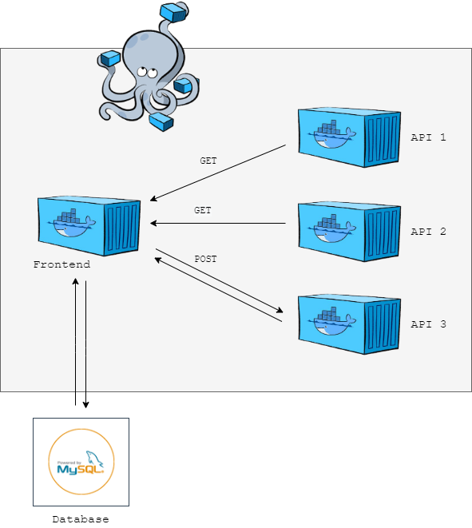

In words: the front-end sends GET requests to API-1 and API-2. It then sends their responses to API-3 as a POST request, and API-3 sends its data back in response. Now, finally, the front-end can send requests to the MySQL instance to INSERT the new entry, and SELECT the old entries in order to display a history to the user as required.

*This diagram also has a previous version, which can be viewed [here](./images/Backend.png)*

### Refactoring
Having a continuous deployment approach to this project means the time between uploading a new change and the deploy occurring should be minimal. While the approach laid out above hits the MVP, I have refactored it in several areas to improve performance.

#### Nexus as a Private Image Repository
Using a private repository over docker.io allows images to be pushed & pulled much quicker, as the connection is (at least in my case) on the same network.

Result: reduced total time of build, push, and deploy stages from 30-60 seconds down to 3-10 seconds without changes, and 60-120 seconds down to 20-40 with changes.


#### Ansible Plug-ins and Options
The slowest part of the pipeline is by far the configuration of the VMs. After doing some research on potential improvements, I came up with 2 potentail solutions:

**1.** Ansible's pipelinining option
> Enabling pipelining reduces the number of SSH operations required to execute a module on the remote server, by executing many ansible modules without actual file transfer. This can result in a very significant performance improvement when enabled.
[source](https://docs.ansible.com/ansible/2.3/intro_configuration.html#pipelining)

Result: no noticeable improvements

**2.** Ansible's "mitogen" plug-in
> Expect a 1.25x - 7x speedup and a CPU usage reduction of at least 2x, depending on network conditions, modules executed, and time already spent by targets on useful work. 
[source](https://mitogen.networkgenomics.com/ansible_detailed.html#overview)  

Result: no noticeable improvements

## Development
### Front-End
When navigating to port 80 (default http port) on the NGINX's IP, the steps will be taken as outlined in the previous 2 diagrams ([here](#docker-swarm) and [here](#the-4-services)) and the relevant information will be displayed in the format as shown below. This result is displayed using HTML (with Jinja2) for the layout, and CSS for styling.

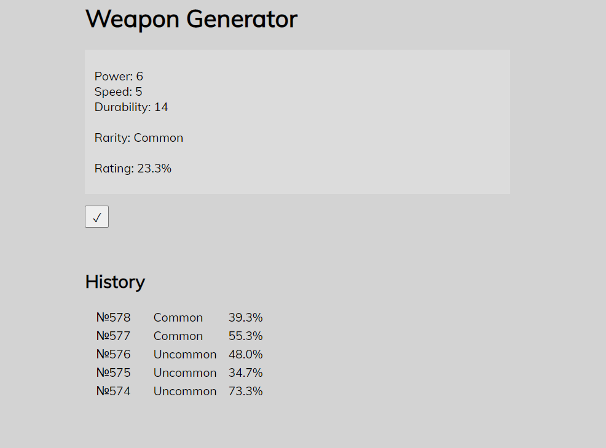

### Unit Testing
Unit testing is used here by seperating the route functions and testing each function with various scenarios. These are designed to assert each function returns an expected response under each given scenario. These tests are run automatically after every Git push using Jenkins. Jenkins prints out whether or not the tests were successsful and also gives a coverage report noting the percentage of the application that was tested.

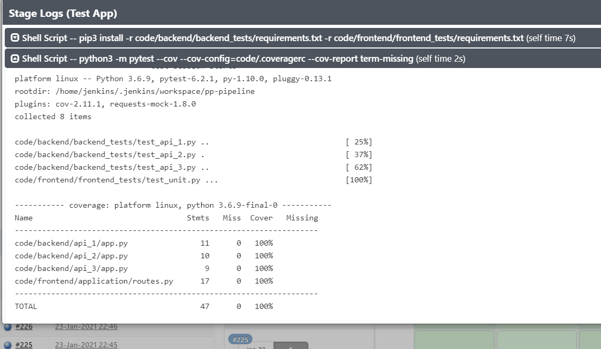

This coverage report indicates that every line in each of my routes has been tested at least once in some scenario in the unit testing. 

The precise lines used in my Jenkinsfile for testing are:
```py
pip3 install -r code/backend/backend_tests/requirements.txt -r code/frontend/frontend_tests/requirements.txt
python3 -m pytest --cov --cov-config=code/.coveragerc --cov-report term-missing --cov-report xml --junitxml junit.xml
 ```
 
 This installs the packages required to run testing in two requirements.txt files, and then runs the tests. 
 
This approach has been refactored from originally running every test individually in a bash `for` loop - this new approach is more elegant. In order to accurately report coverage for what has been tested with this new approach, I made use of a .coveragerc file, which tells pytest exactly which files and lines to include or ignore (ie. it doesn't need to check coverage of the app.run() line since this will never run in testing).  

This result also produces a junit.xml file which is used by the Jenkins Junit plug-in to produce advanced testing reports, further easing traceback for the developer. An example of these results can be seen below.

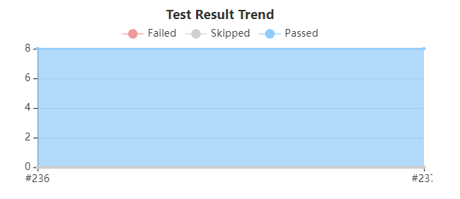
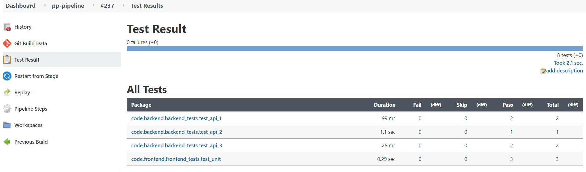


## Footer
### Future Improvements
* Reduce down-time on the deploy stage - seems to be an issue with the NGINX load balancer.
* A leaderboard for the best weapons that have been found.
* Improve testing to include integration testing.

### Author
Oliver Nichols

### Acknowledgements
* [Harry Volker](https://github.com/htr-volker)
* [Nathan Forester](https://github.com/nathanforester) 
